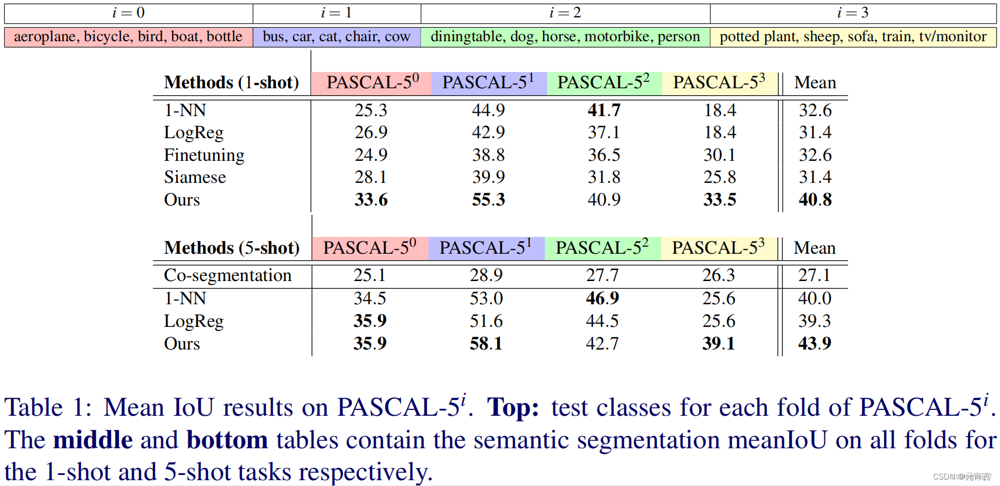

# pascal-5i

## 1. pascal-5i数据集介绍
pascal-5i来自于《[One-Shot Learning for Semantic Segmentation](https://doi.org/10.48550/arXiv.1709.03410)》
这篇经典小样本语义分割论文。它从PASCAL VOC 20个语义类的集合L中，我们抽样5个，
并将它们视为测试标签集$ L_{test}=\{5i+1,...,5i+5\}$，
其中i为the fold number，剩下的15个形成了训练标签集$L_{train}=\{5i+1,...,5i+5\}$。其实思路和k-fold交叉验证很像.

其中pascal-5i训练集来自pasca_voc_aug的训练集.其mask经过处理,
也就是把非查询集的类别标记为背景.同样pascal-5i的验证集来自pasca_voc_aug的验证集.

## 2.代码如何启动
+ 修改config配置文件
+ 运行main.py
详细介绍可见[PASCAL-5I小样本语义分割数据集的制作](https://blog.csdn.net/qq_41609728/article/details/138164713?spm=1001.2014.3001.5501)

